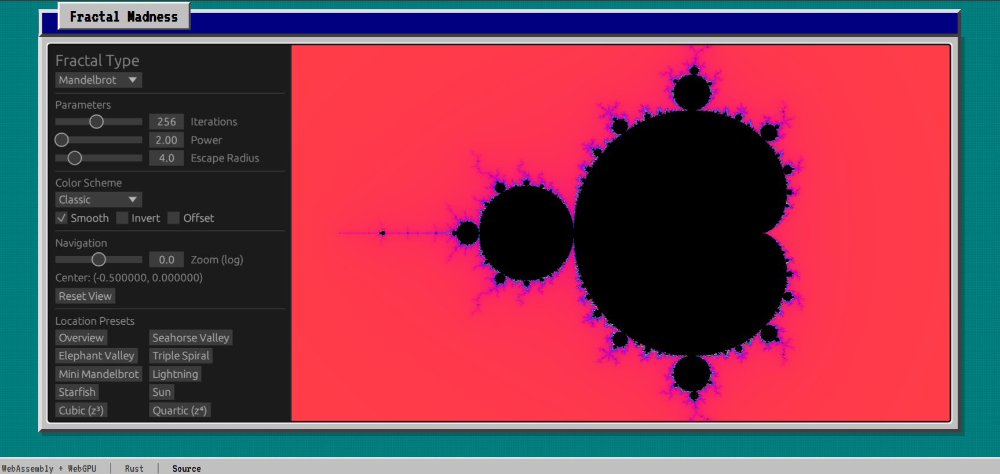

# Fractal Madness

<div align="center">
          <a href="https://fractal-madness.pages.dev/" target="_blank">
          
          </a>
      <br>
  </div>
<br>

A GPU-accelerated fractal visualizer built with Rust and WebGPU, compiled to WebAssembly for browser deployment.

## Features

- **9 Fractal Types**:
  - *Classic Escape-Time*: Mandelbrot, Tricorn, Celtic, Burning Ship
  - *Julia Variants*: Julia, Buffalo Julia, Celtic Julia
  - *Advanced*: Newton (root-finding), Phoenix (memory-based)
- **26 Color Schemes**: Classic, Fire, Ocean, Rainbow, Grayscale, Electric, Neon, Sunset, Forest, Lava, Ice, Plasma, Cosmic, Autumn, Matrix, Vintage, Candy, Metal, Toxic, Aurora, Desert, Deep Sea, Magma, B&W Bands, Psychedelic, Thermal
- **Color Modifiers**: Smooth coloring, Invert colors, Color offset effects
- **Interactive Controls**: Pan with mouse drag, zoom with scroll wheel
- **Real-time Parameters**: Adjust iterations, power, escape radius
- **Julia Set Explorer**: Adjust the complex constant c in real-time with 10 presets (Classic, Dragon, San Marco, Siegel Disk, Dendrite, Spiral, Douady Rabbit, Snowflake, Galaxies, Lightning)
- **58+ Location Presets**: Curated locations across all fractal types
- **Per-Fractal Memory**: Color schemes and settings remembered per fractal type
- **Performance Warnings**: Dynamic warnings for computationally expensive settings
- **Retro UI Theme**: Windows 95-style aesthetic with VT323/Press Start 2P fonts and resizable control panel

## Tech Stack

- **Rust** - Core logic and fractal computation
- **wgpu** - WebGPU/WebGL2 graphics abstraction
- **egui** - Immediate mode GUI
- **wasm-pack** - Rust to WebAssembly compilation
- **Vite** - Frontend build tool

## Requirements

- [Rust](https://rustup.rs/) (with `wasm32-unknown-unknown` target)
- [wasm-pack](https://rustwasm.github.io/wasm-pack/installer/)
- [Node.js](https://nodejs.org/) (v18+)

## Quick Start

```bash
# Install Rust WASM target
rustup target add wasm32-unknown-unknown

# Install wasm-pack
cargo install wasm-pack

# Install Node dependencies
npm install

# Development (builds WASM and starts dev server)
npm run dev

# Production build
npm run build
```

Open http://localhost:5173 in a modern browser.

## Project Structure

```
fractal-madness/
├── src/                    # Rust source
│   ├── lib.rs              # WASM entry point
│   ├── renderer.rs         # GPU rendering pipeline
│   ├── webgpu.rs           # WebGPU initialization
│   ├── ui.rs               # egui control panel
│   ├── input.rs            # Mouse input handling
│   ├── color.rs            # Color scheme definitions
│   └── fractal/            # Fractal implementations
│       ├── mod.rs          # Module exports
│       ├── mandelbrot.rs
│       ├── julia.rs
│       ├── burning_ship.rs
│       ├── tricorn.rs
│       ├── celtic.rs
│       ├── buffalo.rs
│       ├── newton.rs
│       └── phoenix.rs
├── shaders/
│   ├── fractal.wgsl        # Main fractal computation shader
│   ├── fullscreen.wgsl     # Fullscreen quad vertex shader
│   └── display.wgsl        # Display/output shader
├── web/                    # Frontend
│   ├── index.html
│   ├── main.ts
│   ├── style.css           # Windows 95-style CSS theme
│   └── public/             # Static assets
│       ├── favicon.svg
│       ├── favicon.ico
│       └── site.webmanifest
├── pkg/                    # WASM build output (generated)
└── dist/                   # Production build (generated)
```

## Browser Compatibility

Uses WebGL2 backend for broad compatibility. Tested on:
- Chrome 90+
- Firefox 89+
- Edge 90+
- Safari 15+

## Controls

| Action | Input |
|--------|-------|
| Pan | Click and drag |
| Zoom | Mouse wheel |
| Reset | "Reset View" button |

## Parameters

| Parameter | Range | Notes |
|-----------|-------|-------|
| Iterations | 10 - 10,000 | Logarithmic slider |
| Power | 2.0 - 8.0 | Enables Multibrot variants (z³, z⁴, z⁵) |
| Escape Radius | 2.0 - 100.0 | Logarithmic slider |
| Julia Real | -2.0 to 2.0 | For Julia-type fractals only |
| Julia Imaginary | -2.0 to 2.0 | For Julia-type fractals only |
| Zoom | 1e-10 to 1e10 | Logarithmic scale |

## Performance Notes

- **Newton fractals** are computationally expensive (~3.5x cost vs standard fractals)
- **Phoenix fractals** have moderate overhead (~1.5x cost)
- The UI displays warnings when iteration counts exceed recommended thresholds

### Per-Fractal Warning Thresholds

| Fractal Type | Warning Threshold |
|--------------|-------------------|
| Newton | 140 iterations |
| Phoenix | 330 iterations |
| Buffalo Julia / Celtic Julia | 400 iterations |
| Celtic | 430 iterations |
| Tricorn / Burning Ship | 450 iterations |
| Mandelbrot / Julia | 500 iterations |

## License

MIT
